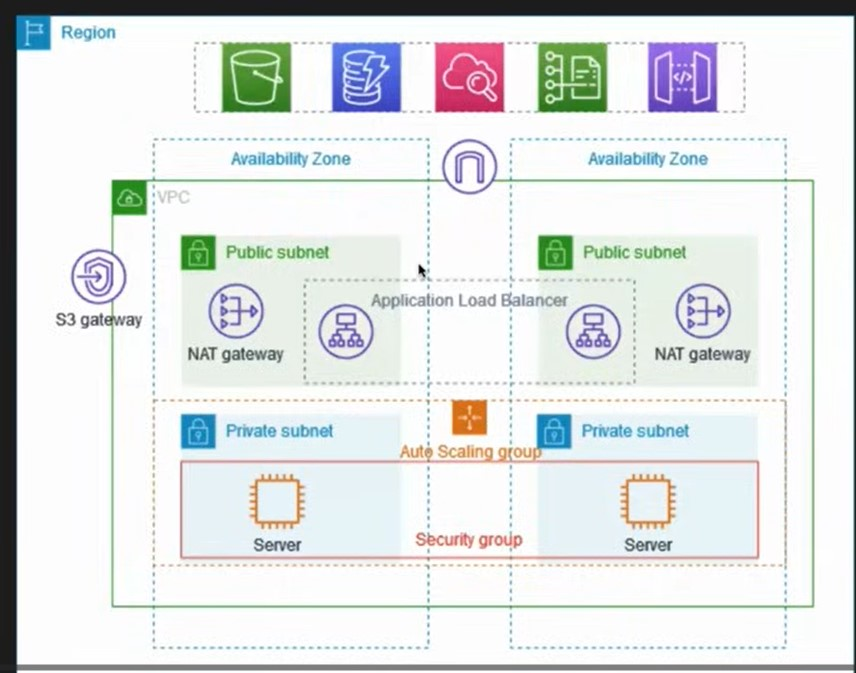

# cloud 
Cloud is computer resources over the internet.

# cloud computing : 
It is on demand delivery of services over the internet.

# Public Cloud : 
Virtual machines can be provided to any users who have account with aws/azure/GCP.

# Private Cloud : 
Organizations buy and maintains their own servers (virtual machines and other resources).

# Mixed Cloud (Public + Private) : 
We can also create Private Cloud inside Public cloud. 

# Why Public Cloud is so popular ?
Two main reason : 
<br>
1. To get rid of mentainance of entire setup of servers.
<br>
2. Cost Efficient.

# How AWS is better than others ?
Because AWS is the one who intially started this cloud concept. 

# Main Disadvantage of Public Cloud : 
Security Concerns
<br>
Server Downtime
<br>
Network Requirement

# AWS IAM (Identity and Access Management)
IAM solves the problem of authentication and authorization using their policy.

# Why we need Users, Policies, Groups and Roles : 
Users : Admins create users for their organization. 
<br>
Policies : Policies are attached with user account which provides the user some access to resoursces.
<br>

Groups : Instead of creating multiple users and attaching policies, admins can create groups like Group of ["Developer","QA Engineer", "DB-Admins","others"] and each of them have their own policies. When a new employee comes to an organization the DevOps engineer just check the employee is "Developer" or "QA Engineer" or  "DB-Admins" or "others" and create account and put him into groups. 

<br>

Role : In AWS IAM, a Role is an identity that grants temporary permissions to access AWS resources. 
<br>
Unlike a user, a role:
<br>
Does not have a username or password
<br>
Is assumed by services, users, or applications
<br>
Provides temporary security credentials
<br>
Roles are commonly used to:
<br>
Allow an EC2 instance to access S3
<br>
Let one AWS account access resources in another account
<br>
Give applications secure access without storing keys
<br>
Github Repo : https://github.com/iam-veeramalla/aws-devops-zero-to-hero/tree/main/day-2

# EC2 instance 
EC2 stands for Elastic Cloud Compute. It is a service offered by AWS which provides virtual servers which is elastic in nature.
<br>
Compute means we are requesting Virtual Servers (CPU,RAM,Disks)
<br>
Cloud : service over the internet. 
<br>
Elastic : It means this service can be scale up and down.
<br>
Advantages : 
<br>
No need to upgrade unlike in physical server.
<br>
no need to manage unlike in physical server.
<br>
There are 5 diff types of EC2 instance : 
<br>
1. General Purpose : Mostly used.
<br>
2. Compute Optimized : Used for ML model, gaming servers.
<br>
3. Memory Optimized : Used for big data analytics.
<br>
4. Storage Optimized 
<br>
5. Accelated Optimized : Integrated with GPUs,AI-chips

# How to login on EC2 instance : 
Open Gitbash 
<br>

```bash 

ssh -i <key-value-pair-file-path> ubuntu@<public-ipv4>
<br>
chmod 600 <key-value-pair-file-path> // to secure it

```

<br>
Github Repo : https://github.com/iam-veeramalla/aws-devops-zero-to-hero/tree/main/day-3

# Virtual Private Cloud : 
A VPC (Virtual Private Cloud) is our own private network inside AWS.
<br>
It lets us create an isolated environment where we can launch and manage AWS resources (like EC2, RDS, etc.) with full control over:
<br>
IP address ranges
<br>
Subnets (public and private)
<br>
Routing (route tables, gateways)
<br>
Network security (security groups, NACLs)
<br>
All configuration of VPC is setup by the devops engineer of an organization.
<br>
Size of VPC is defined by the IP address range. And further this IP address range can be divided into subnets for different subprojects inside a project of an organization.
<br>
Example : If an user wants to access application which is hosted on VPC then firstly it pass the Internet gatway of the VPC and then it passes to the public subnet inside VPC then there will be a load balancer attached to public subnet which has target group and takes the request to particular application through route table (router) and then request to needs to pass security groups before reaching to particular application. 
<br>
If an application needs to download a package from the public internet (google.com) then <b>NAT gatway</b> is used to mask the ip address of private virtual machines and application with load balance ip addr or router ip addrerss.
<br>
VPC flow logs contains all the logs of requests. 
<br>
Github Repo : https://github.com/iam-veeramalla/aws-devops-zero-to-hero/tree/main/day-4
<br>
Security Groups and NACL(Network Access Control List) are very crucial for our application because these are last point of security. Security Groups are implemented at instance level and NACL implemented at subnet level.
<br>
There are two concepts in Security Groups : 
<br>
1. Inbound Traffic  : Request comming into ec2 instance from outside. 
<br>
2. Outbound Traffic : Request outgoing from ec2 instance to public network like google. 
<br>
By default when we create an ec2 instance then it provides default VPC because it assigns a security groups to our instance which deny every incoming request and allow every outgoing request except traffic on port 25. 
<br>
NACL : A Network Access Control List is a stateless firewall that controls inbound and outbound traffic at the subnet level. It operates at the IP address level and can allow or deny traffic based on rules that you define. NACLs provide an additional layer of network security for your VPC. Here we define which traffic will be denied or allowed.
<br>
When we create a VPC on aws then aws will automatically create internet gatway, NACL with default configuration and route table.
<br>
In NACL configuration order of inbound rules is very important. If the very first allows to any port or ip address then that request will be allowed even if it is denied according to rule defined in the end. 
<br>
Github Repo : https://github.com/iam-veeramalla/aws-devops-zero-to-hero/tree/main/day-5

# How to setup production level VPC for an application : 
To set up a production-level VPC with high availability, you must distribute resources across multiple Availability Zones (AZs) to ensure resilience against single-zone failures. 
<br>
Step 1. Create VPC and configure core Networking Setup (Feature provided inside VPC)
<br>
VPC & AZs: Create a VPC with a CIDR block (e.g., 10.0.0.0/16) spanning two AZs.
<br>
Subnets: Provision four subnets:
<br>
2 Public Subnets: One in each AZ for load balancers and the bastion host.
<br>
2 Private Subnets: One in each AZ for application servers.
<br>
Gateways & Connectivity:
<br>
Internet Gateway (IGW): Attach one IGW to the VPC. Note that a VPC can only have one IGW attached at a time; it is a horizontally scaled, redundant service by default.
<br>
NAT Gateways: Deploy two NAT Gateways, one in each public subnet. This ensures that if one AZ goes down, the other still has internet egress.
<br>
Routing:
<br>
Public Route Table: Routes 0.0.0.0/0 to the Internet Gateway.
<br>
Private Route Tables: Create two separate private route tables. Route 0.0.0.0/0 in Private Subnet A to NAT Gateway A, and Private Subnet B to NAT Gateway B. 
<br>
Step 2 :  Security & Control (Feature provided under VPC service)
Network ACLs (NACLs): Use two separate NACLs to provide stateless filtering at the subnet level.
<br>
Security Groups (SGs):
<br>
ALB SG: Allow inbound HTTP/HTTPS from 0.0.0.0/0.
<br>
App SG: Allow inbound traffic only from the ALB Security Group on the application port.
<br>
Bastion Host: Launch a small EC2 instance (e.g., t3.micro) in a public subnet with an Elastic IP to safely access private instances via SSH. 
<br>
Bastion SG: Allow SSH (port 22) only from your specific office/home IP.
<br>
3. Application Layer
<br>
Auto Scaling Group (ASG): Deploy your application instances into the two private subnets. Use a Launch Template to define instance configurations. This feature is provided inside EC2 services.
<br>
Load Balancers: Deploy an Application Load Balancer (ALB) across the two public subnets. While the ALB is a single logical resource, it automatically creates nodes in both AZs for high availability. This feature is provided inside EC2 services.


# Route 53
Route 53 on aws provides DNS as service. 
<br>
Route 53 provides three main functions:
<br>
1. Domain Registration : 
<br>
We can buy and manage domains directly (e.g., myapp.com).
<br>
2. DNS Routing :
It routes traffic to AWS resources(available in different hosted zones) such as:
<br>
EC2
<br>
S3 static websites
<br>
Load Balancers
<br>
CloudFront distributions
<br>
Note : Hosted Zones Configuration -> To do this we need to configure the dns records for servers running on different hosted zones.
<br>
3. Health Checking & Failover
<br>
It can monitor endpoints and automatically route traffic to healthy resources.

# Important Point : 
To improve resiliency, we deploy the servers in two Availability Zones, by using an Auto Scaling group and an Application Load Balancer. For additional security, we deploy the servers in private subnets. The servers receive requests through the load balancer. The servers can connect to the internet by using a NAT gateway. To improve resiliency, we deploy the NAT gateway in both Availability Zones.
<br>

<b>Auto Scaling Group (ASG) :</b> An Auto Scaling Group (ASG) in AWS is a service that automatically manages a group of EC2 instances to ensure the right number of servers are running at all times.
<br>
It helps we:
<br>
Automatically add instances when traffic increases
<br>
Automatically remove instances when traffic decreases
<br>
Replace unhealthy instances
<br>
Maintain high availability across multiple Availability Zones
<br>
we define:
<br>
Minimum number of instances
<br>
Maximum number of instances
<br>
Desired capacity
<br>
Scaling rules (based on CPU, memory, requests, etc.)
<br>
Example:
If our web app gets more users, ASG can automatically launch new EC2 instances.
When traffic drops, it terminates extra instances to save cost.
<br>
<b>Load Balancer : </b>
<br>
A Load Balancer is a service that distributes incoming traffic across multiple servers (instances) so no single server becomes overloaded.
<br>
In AWS, Elastic Load Balancing (ELB) automatically:
<br>
Receives requests from users
<br>
Spreads them across multiple EC2 instances
<br>
Sends traffic only to healthy instances
<br>
Improves availability, performance, and fault tolerance
<br>
Types of AWS Load Balancers:
<br>
Application Load Balancer (ALB) – for HTTP/HTTPS (Layer 7)
<br>
Network Load Balancer (NLB) – for TCP/UDP, very high performance (Layer 4)
<br>
Gateway Load Balancer (GLB) – for network appliances
<br>
Benefits:
<br>
High availability
<br>
No single point of failure
<br>
Smooth handling of traffic spikes
<br>
Works with Auto Scaling Groups
<br>
<b>Target Group :</br> 
A Target Group is a logical group of resources (targets) that a Load Balancer sends traffic to.
<br>
Targets can be:
<br>
EC2 instances
<br>
IP addresses
<br>
Lambda functions
<br>
Containers (ECS/EKS)
<br>
When you create a Load Balancer, you attach one or more Target Groups to it. The Load Balancer:
<br>
Routes requests to the targets in the group
<br>
Performs health checks on each target
<br>
Sends traffic only to healthy targets
<br>
Example:
<br>
An Application Load Balancer receives web traffic and forwards it to a Target Group containing 3 EC2 instances. If one instance becomes unhealthy, it is removed automatically from traffic.
<br>
<b>Bastion Host or Jump Server : </b> 
<br>
A Bastion Host (also called a Jump Server) is a special server used as a secure entry point to access private resources in a network.
<br>
In AWS, it is typically:
<br>
An EC2 instance placed in a public subnet
<br>
Exposed to the internet (usually only on SSH/RDP)
<br>
Used to connect to EC2 instances in private subnets
<br>

<br>
Some Interview Questions : https://github.com/iam-veeramalla/aws-devops-zero-to-hero/blob/main/day-8/
<br>

# Amazon S3 : 
S3 : It is a Simple Storage Service provided by the AWS.
<br>
Maximum size of file is 5TB.
<br>
S3 buckets are globally accessible.
<br>
Github Repo : https://github.com/iam-veeramalla/aws-devops-zero-to-hero/blob/main/day-9/
<br>

# AWS CLI : 
AWS CLI solves the problem of automation because AWS UI is not automation friendly. 
<br>
Tools used to automate the infrstructure on aws Using API :
<br>
AWS CLI
<br>
Terraform
<br>
Cloud Formation
<br>
CDK(Cloud Development Kit)
<br>
<b>AWS CLI <b>
<br>
It is a Python-based utility (written in Python) that allows us to manage and automate AWS infrastructure using command-line commands.
<br>
Command Reference : aws-cli documentation
<br>
Behind the scene, AWS-CLI converts the command into an API call and send to aws.
<br>
It is not used to create heavily configured infrastructure. For this we use Terraform, Cloud Formation or CDK.
<br>

```bash 
# How to configure AWS CLI on ubuntu : 

# After installing AWS CLI, write command : 
aws configure 

# It asks for Access Key ID, Secret Key, region and response type. 

```

<br>

# AWS Cloud Formation Templates(CFT)
It is a tool used to create infrastructure on aws and follows IaC (Infrastructure as Code) principle.
<br>
It uses the YAML files to create infrastructure.
<br>
Basically it is a template that helps in cloud formation. 
<br>
Principle of IaC : 
<br>
All IaC Tool should act as middleman between user and cloud provider. 
<br>
Tools takes template(written in YAML,JSON,etc) from user and convert into api call which is understable to 
cloud providers. 
<br>
Cloud Formation template only support AWS. 
<br>
Templates are declarative and versioned where declarative means what you sees is what you have and versioned is related with concept of GIT(a version control system).
<br>
CFT supports Creation of Infrastructure. 
<br>
CFT supports DriftDetection. 
<br>
DriftDetection : Drift Detection in AWS is a CloudFormation feature that periodically checks whether your actual AWS resources still match what is defined in your CloudFormation template.
<br>
What we need to do to use CFT : 
<br>
Write the template in YAML or JSON. 
<br>
Go to AWS UI and search for Cloud Formation(CF) and create a CF stack and push the template to it. 
<br>
Helpful VS-CODE Extensions : AWS Toolkit , YAML
<br>
Reference : AWS CloudFormation documentation. 
<br>
Teraform is highly used over CFT because it supports multiple cloud providers.
<br>

# AWS CI/CD : 
AWS provides a comprehensive set of CI/CD (Continuous Integration/Continuous Deployment) services that enable developers to automate and streamline their software delivery processes.
<br>
AWS CodeCommit, AWS CodePipeline, AWS CodeBuild, and AWS CodeDeploy are the key services involved in achieving CI/CD on AWS platform.

# AWS CodeCommit : 
<br>
AWS CodeCommit is just like a github but it is a aws managed service.
<br>
Organization mostly use private repositories or installing gitlab on their own server.
<br>
We can use AWS CodeCommit also in place of github.
<br>
<b>Advantages </b>
<br>
Managed Git : It is a git managed service.
<br>
Scalability : AWS automatically scale up the resources when no of repo increases.
<br>
Reliability : AWS also provides SLA for this service.
<br>
<b>Disadvantages </b>
<br>
Limited Features
<br>
AWS Restricted
<br>
Less Integration with services outside AWS
<br>
Because of these disadvantages organisation uses private git repository or self hosted git repository or gitlab on their own server.

# AWS Code pipeline : 
AWS Code pipeline is very similar to CI/CD tool (jenkins). It is an orchestrator which invokes code build whether it is Jenkins code build or AWS Code build. We need to provide the environment to aws code build and this environment would be a virtual machine image or docker image.
<br>
It coordinates and automates the stages of a software release process by triggering actions such as source code retrieval, build, testing, and deployment. CodePipeline integrates with services like AWS CodeBuild for building and testing, and can push artifacts or container images to registries such as Amazon ECR.
<br>
Jenkins is more popular than AWS code pipeline because it is open sources and it is not restricted on one cloud providers, efficiently managed with master-dynamic(docker) slave architeture.
<br>
Advantage of AWS Code Pipeline is that it is totally managed by AWS. Organisations are just need to pay as they use it.
<br>

# How to setup AWS CI : 
Step 1 : Create AWS CodeBuild project using Github Repository having some codebase, Dockerfile and buildspec.yaml file (buildspec.yaml sample template and editor provided by aws).
<br>
Test it by manually by clicking on start build button. 
<br>
In the Build process, we build docker image and push it to docker registry(docker.io). 
<br>
Store the docker credentials in the parameter store of AWS System Manager .
<br>
Step 2 : Create AWS Codepipeline project and integrate it with Github source code and CodeBuild project.
<br>
Make changes in the github source code and check whether build starts automatically or not. 
<br>
Note : We can use Codebuild as code builder and deployer.

# How to setup AWS CD : 
Step 1 : Create a AWS codeDeploy application by selecting the Cloud Plateform(EC2,AWS Lambda, ECS).
<br>
Step 2 : If we want to deploy our application on AWS EC2 then we need to create EC2 instance and assign a tag eg: "name:simple-fastapi-app". 
<br>
Step 3 : Install an agent on that EC2 instance using following commands in the link below : 
<br>
Link : https://docs.aws.amazon.com/codedeploy/latest/userguide/codedeploy-agent-operations-install-ubuntu.html 
<br>
Also install the docker on ec2 instance.
<br>
Step 4 : Create a role(eg: ec2-codeDeploy-role) which allows EC2 to talk with AWS CodeDeploy add permissions for CodeDeploy and EC2FullAccess.
<br>
Step 5 : Select the EC2 instance and click on actions and then security and modify IAM role and assign the role(eg: ec2-codeDeploy-role) to it. 
<br>
Step 6 : Restart the the codedeploy-agent by using commmand - "sudo service codedeploy-agent restart". 
<br>
Step 7 : Create a deployment group in the CodeDeploy application by providing IAM role(eg: ec2-codeDeploy-role), choosing Deployment Type(In-place), choosing Amazon EC2 Instances as Environment configuration, providing the same tag(provided to EC2 instance), disable the loadbalancer. 
<br>
Step 8 : Create deployment in the codeDeploy application by providing github repository name and last commit. 
<br>
Step 9 : Add a new stage(eg: code-deploy) in the Codepipeline to invoke the codedeploy.

# CloudWatch : 
It is a monitoring and observability service which is watching activities on aws. 
<br>
Main Features of CloudWatch : Monitoring (using Real Life metrics), alerting(alerms), reporting and logging. 
<br>
<b>1. Metrics</b>
<br>
Numeric data such as:
<br>
EC2 CPU utilization
<br>
Network traffic
<br>
Disk usage
<br>
Lambda invocations
<br>
Example:
<br>
If CPU > 80% → trigger alarm
<br>
<b>2. Alarms</b>
<br>
We can create alerts:
<br>
Email (SNS)
<br>
Trigger Auto Scaling
<br>
Stop/terminate EC2
<br>
Run Lambda function
<br>
<b>3. logging</b>
<br>
Collects logs from:
<br>
EC2
<br>
Lambda
<br>
Applications
<br>
VPC Flow Logs
<br>
We can search and analyze logs like which other service is used by EC2 instance. We can also get log insights by writing queries.
<br>
<b>4. Custom metrics</b>
<br>
By default metrics contains CPU utilization but not memory utilization so we need to setup custom metrics to know memory utilization.
<br>
CloudWatch also plays a critical role in cost optimization (using lambda functions) and auto scaling. 
<br>
Learn more : https://github.com/iam-veeramalla/aws-devops-zero-to-hero/tree/main/day-16
<br>

# AWS Lambda : 
AWS Lambda is a serverless compute service of AWS that allows to run code without managing servers.
<br>
Two main properties : 
<br>
1. Compute : It creates the resources like EC2 but it creates the compute when needed and It automatically tear down the compute when it is not needed. 
<br>
2. Serverless : We don't need to configure and manage the servers to scale up or scale down unlike EC2. 
<br>
Note : In EC2 instace we know public ip addresses and where is hosted but we don't know any of these things in the lambda function. 
<br>
It is event-driven in nature. Lambda functions are triggered by events. 
<br>
Uses : 
<br>
It is used for cost optimization. 
<br>
It can be used for security/compliance like Any organisation don't want that any employee create EBS (GP-2) because it has some security issues so we can send notification using lambda functions to Management team to delete it. 
<br>
Learn More : https://github.com/iam-veeramalla/aws-devops-zero-to-hero/tree/main/day-17
